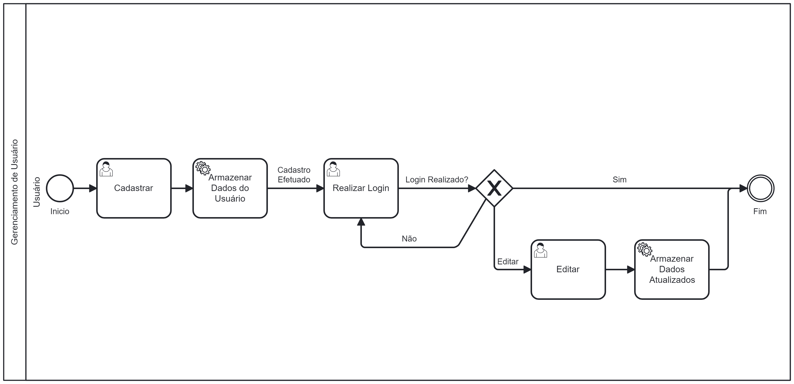

# Processo 1 – Gerenciamento de Usuário

Este processo é responsável pelo gerenciamento de perfis de usuários na plataforma. O fluxo começa com o usuário solicitando o cadastro. O sistema então verifica se o usuário deseja cadastrar um novo perfil, editar um existente ou excluir um cadastro.

### Detalhamento das Atividades

1. **Evento de Início:**
   - O processo se inicia quando o usuário interage com a interface do sistema e solicita a ação de cadastro.

2. **Solicitar Cadastro do Usuário:**
   - O usuário preenche um formulário com as informações solicitadas e submete a solicitação.

3. **Decisão: Cadastrar Usuário?:**  
   O sistema apresenta ao usuário três opções para gestão de perfil:

   - **Cadastrar Usuário:** Criação de um novo perfil de usuário.
   - **Excluir Usuário:** Remoção de um usuário existente.
   - **Editar Usuário:** Atualização das informações de um usuário existente.

4. **Cadastrar Usuário:**
   - O sistema processa os dados fornecidos e cria um novo perfil com base nas informações inseridas.

5. **Excluir Usuário:**
   - O sistema remove os dados do usuário selecionado da base de dados.

6. **Finalização:**
   - O processo termina após a conclusão de qualquer uma das três ações (cadastrar, excluir ou editar).

---

### Tabela de Detalhamento 1 – Cadastrar Usuário

| Campo                | Tipo           | Restrições                                                                 | Valor Default          | Tarefa do Usuário   |
|----------------------|----------------|----------------------------------------------------------------------------|------------------------|---------------------|                             
| Nome_anônimo                | Caixa de Texto | Mínimo de 3 caracteres                                                     | "Nome Completo"         | Preencher nome    |
| Email                | Caixa de Texto | Formato de e-mail válido                                                   | "usuario@email.com"     | Inserir email       |
| Senha                | Caixa de Texto | Mínimo de 8 caracteres, com ao menos um número, uma letra maiúscula, e um caractere especial | ""                     | Criar senha         |
| Confirmação de Senha  | Caixa de Texto | Deve corresponder à senha                                                  | ""                     | Confirmar senha     |

### Comandos

| Comando            | Destino      | Tipo                                     |
|--------------------|--------------|------------------------------------------|
| Cadastrar | Submissão    | Envia a solicitação de cadastro ao sistema |

---------------------------------------------------------------------------------

### Tabela de Detalhamento 2 – Realizar login

| **Campo**    | **Tipo**       | **Restrições**                                                                      | **Valor Default** | **Tarefa do Usuário** |
|--------------|----------------|-------------------------------------------------------------------------------------|-------------------|-----------------------|
| Email    | Caixa de Texto  | Deve ser um e-mail válido                              | ""                | Inserir CPF ou Email  |
| Senha        | Caixa de Texto  | Mínimo de 8 caracteres| ""                | Inserir senha         |

### Comandos

| **Comando** | **Destino** | **Tipo** |
|-------------|-------------|----------|
| Entrar      | Submissão   | Envia as credenciais para autenticação no sistema |

----------------------------------------------

### Tabela de Detalhamento 3 – Editar Usuário
| Campo   | Tipo      | Restrições                                       | Valor Default       | Tarefa do Usuário     |
|-------------|---------------|-----------------------------------------------------|-------------------------|---------------------------|
| Novo Email  | Caixa de Texto | Formato de e-mail válido                            | usuario@email.com     | Inserir novo e-mail       |
| Nova Nome     | Caixa de Texto | Mínimo de 8 caracteres | "" | Criar Nome     |
| Nova Senha  | Caixa de Texto | Mínimo de 8 caracteres | "" | Criar nova senha     |

### Comandos 

|**Comando**  |**Destino**    | **Tipo**                                     |
|--------------|-----------------|------------------------------------------------|
| Salvar       | Submissão       | Envia os novos dados para atualizar o usuário  |
| Cancelar     | Retorno         | Descarta alterações e retorna à tela anterior  |

-----------

