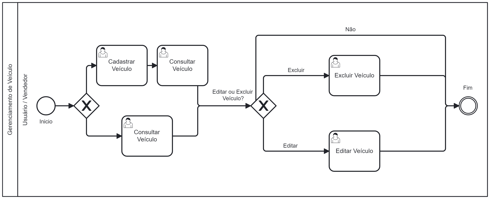

### 3.3.1 Processo 2 – Gerenciamento de Veículo

O processo de Gerenciamento de Veículo é uma funcionalidade fundamental no sistema DriveNShop, permitindo que usuários e vendedores gerenciem informações sobre veículos de forma eficiente e organizada. Este processo é composto por diversas etapas, cada uma com ações específicas, que garantem uma experiência fluida para o usuário.

---

# Detalhamento das Atividades

## 1. Cadastrar Veículo
**Descrição:** O vendedor insere os dados do veículo que deseja disponibilizar na plataforma.  
**Objetivo:** Permitir o registro de veículos para venda.

## 2. Consultar Veículo
**Descrição:** O vendedor acessa a lista de veículos cadastrados ou visualiza detalhes de um veículo específico.  
**Objetivo:** Fornecer uma visão geral ou detalhada dos veículos cadastrados.

## 3. Excluir Veículo
**Descrição:** O vendedor escolhe remover um veículo previamente cadastrado.  
**Objetivo:** Remover veículos que não estão mais disponíveis para negociação.

## 4. Editar Veículo
**Descrição:** O vendedor acessa as informações do veículo e realiza alterações nos dados cadastrados.  
**Objetivo:** Atualizar os dados do veículo de forma organizada.

## 5. Fim do Processo
**Descrição:** O processo é encerrado após as ações de cadastro, edição, exclusão ou análise de propostas.  
**Objetivo:** Finalizar o gerenciamento do veículo de forma organizada.

---

# Tabela de Detalhamento 1- Cadastrar Veículo

| **Campo**            | **Tipo**         | **Restrição**           | **Valor Default**  |
|-----------------------|------------------|-------------------------|--------------------|
| Marca do Veículo      | Texto            | Obrigatório             | "----------------" |
| Modelo                | Texto            | Obrigatório             | "----------------" |
| Ano                  | Número           | Obrigatório (4 dígitos) | "2024"            |
| Preço                 | Número           | Obrigatório             | "----------------" |
| Descrição             | Caixa de texto   | Opcional                | "----------------" |
| Categoria             | Seleção   | Opcional                | "----------------" |
| Tipo de anuncio            | Seleção   | Obrigatorio               | "----------------" |
| Condição             | Seleção   | Obrigatorio                | "----------------" |
| Quilometragem             | Caixa de texto   | Obrigatorio               | "----------------" |
| Localização             | Seleção   | Obrigatorio                | "----------------" |

### Comandos

| **Comando**   | **Destino**                      | **Tipo**  |
|---------------|----------------------------------|-----------|
| Salvar        | Armazenar os dados preenchidos   | Ação      |
| Cancelar      | Encerrar sem salvar os dados     | Ação      |

---

# Tabela de Detalhamento 2- Editar Veículo

| **Campo**            | **Tipo**         | **Restrição**           | **Valor Default**  |
|-----------------------|------------------|-------------------------|--------------------|
| Marca do Veículo      | Texto            | Obrigatório             | "----------------" |
| Modelo                | Texto            | Obrigatório             | "----------------" |
| Ano                  | Número           | Obrigatório (4 dígitos) | "2024"            |
| Preço                 | Número           | Obrigatório             | "----------------" |
| Descrição             | Caixa de texto   | Opcional                | "----------------" |
| Categoria             | Seleção   | Opcional                | "----------------" |
| Tipo de anuncio            | Seleção   | Obrigatorio               | "----------------" |
| Condição             | Seleção   | Obrigatorio                | "----------------" |
| Quilometragem             | Caixa de texto   | Obrigatorio               | "----------------" |
| Localização             | Seleção   | Obrigatorio                | "----------------" |

### Comandos

| **Comando**   | **Destino**                      | **Tipo**  |
|---------------|----------------------------------|-----------|
| Salvar     | Salvar as modificações feitas    | Ação      |
| Cancelar Alterações "X"      | Descartar as modificações        | Ação      |

---

# Tabela de Detalhamento 3- Excluir Veículo

### Comandos

| **Comando**       | **Destino**                      | **Tipo**  |
|-------------------|----------------------------------|-----------|
| Sim| Remover definitivamente o veículo| Ação      |
| Não          | Voltar à lista de veículos       | Ação      |

---

# Tabela de Detalhamento 4 - Consultar Veículo

| **Campo**            | **Tipo**         | **Restrição**            | **Valor Default**  |
|-----------------------|------------------|-------------------------|--------------------|
| Marca                 | Filtro           | Opcional                | "----------------" |
| Modelo                | Filtro           | Opcional                | "----------------" |
| Ano                  | Filtro           | Opcional                 | "----------------" |
| Preço                  | Filtro           | Opcional                 | "----------------" |
| Tipo_Transação               | Filtro           | Opcional                 | "----------------" |
| Localização               | Filtro           | Opcional                 | "----------------" |
| Quilometragem               | Filtro           | Opcional                 | "----------------" |
| Descrição                | Filtro           | Opcional                 | "----------------" |
| Status               | Seleção          | Obrigatório                | Ativo |

### Comandos

| **Comando**   | **Destino**                      | **Tipo**       |
|---------------|----------------------------------|----------------|
| Editar   | Editar informações dos veículos        | Ação      |
| Excluir  | Exclui anúncio            | Ação | 
| Voltar         | Retornar à lista principal       | Navegação      |

---

