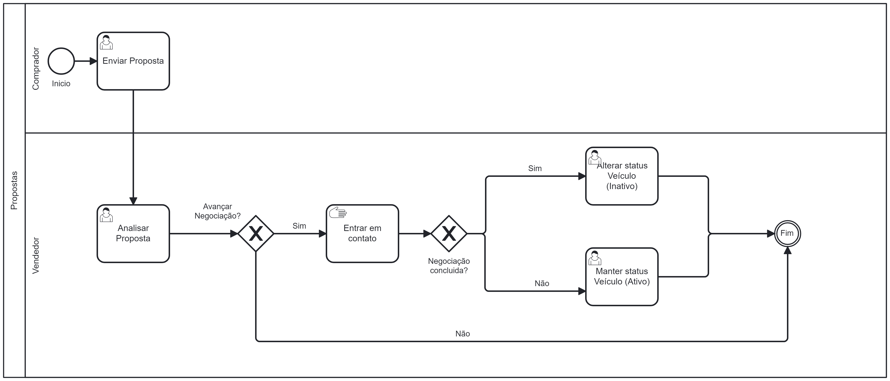

### 3.3.4 Processo 3 – Propostas
O processo inicia com o comprador enviando uma proposta ao vendedor. A proposta é analisada pelo vendedor, que então decide se aceita ou não a proposta. Se o vendedor aceitar a proposta, ela será recebida e validada no sistema, encerrando o processo. Se o vendedor não aceitar, o processo é finalizado sem validação ou altera.

### Detalhamento das Atividades

1. **Enviar Proposta (Comprador)**  
   - O comprador inicia o processo enviando uma proposta de compra para o vendedor.

2. **Analisar Proposta (Vendedor)**  
   - O vendedor recebe a proposta enviada pelo comprador e realiza sua análise para verificar se atende às suas expectativas.

3. **Decisão - Avançar Negociação?**  
   - **Sim**:  
     - O vendedor decide que a proposta é válida para dar continuidade.  
     - O próximo passo é entrar em contato com o comprador para avançar nas negociações.  
   - **Não**:  
     - O vendedor opta por não prosseguir com a negociação.  
     - O processo é encerrado sem alterações no status do veículo.

4. **Entrar em Contato (Vendedor)**  
   - Caso o vendedor decida avançar com a negociação, ele entra em contato diretamente com o comprador para discutir os próximos passos.

5. **Decisão - Negociação Concluída?**  
   - **Sim**:  
     - A negociação é finalizada com sucesso.  
     - O status do veículo é alterado para "Inativo", indicando que o veículo não está mais disponível para venda.  
   - **Não**:  
     - A negociação não é concluída por algum motivo.  
     - O status do veículo permanece como "Ativo", permitindo que novas propostas sejam enviadas.

6. **Alterar Status do Veículo (Vendedor)**  
   - Se a negociação foi concluída, o vendedor altera o status do veículo no sistema para "Inativo", refletindo que a venda foi realizada.

7. **Manter Status do Veículo (Vendedor)**  
   - Caso a negociação não seja concluída, o vendedor mantém o status do veículo como "Ativo", sinalizando que ele continua disponível para novos interessados.

8. **Finalização**  
   - O processo é encerrado após:  
     - A negociação ser concluída com a alteração de status para "Inativo".  
     - Ou a decisão de não avançar com a negociação, mantendo o status como "Ativo".
    
       
### Tabela de Detalhamento - Enviar Proposta

| Campos            | Tipo            | Restrição                     | Valor Default           |
|-------------------|-----------------|-------------------------------|-------------------------|
| Tipo de Proposta  | Caixa de seleção| Opções: Venda, Troca, Troca + Valor Adicional | "Selecionar"           |
| Telefone para Contato | Caixa de texto | Mínimo de 10 caracteres       | "(XX) XXXXX-XXXX"       |
| Permuta           | Caixa de texto  | Mínimo de 3 caracteres        | "Carro..."              |
| Valor             | Caixa de texto  | Somente números, valor mínimo de R$ 1,00 | "R$"                   |

### Comandos

| Comando             | Destino                          | Tipo  |
|---------------------|----------------------------------|-------|
| Enviar Proposta     | Enviar a proposta cadastrada     | Ação  |
| Voltar         | Retornar à tela anterior         | Ação  |

### Tabela de Detalhamento - Analisar Proposta

| Campos            | Tipo            | Restrição                     | Valor Default           |
|-------------------|-----------------|-------------------------------|-------------------------|
| Nome  | Caixa de texto|"---------------" | "---------------"           |
| Email | Caixa de texto | "---------------"       | "---------------"      |
| Permuta           | Caixa de texto  | "---------------"       | "---------------"              |
| Valor oferecido           | Caixa de texto  | "---------------" | "---------------"                |
| Telefone para Contato             | Caixa de texto  | "---------------" | "---------------"                   |

### **Comandos**

| **Comando**          | **Destino**                          | **Tipo**        |
|-----------------------|--------------------------------------|----------------|
| Voltar "X"         | Retorna a página anterior        | Ação            |

### Tabela de Detalhamento - Alterar o Status do Veículo (Inativo)

| Campos            | Tipo            | Restrição                     | Valor Default           |
|-------------------|-----------------|-------------------------------|-------------------------|
| Status  | Caixa de Seleção| Obrigatório | Ativo           |

### Tabela de Detalhamento - Manter o Status do Veículo (Ativo)

| Campos            | Tipo            | Restrição                     | Valor Default           |
|-------------------|-----------------|-------------------------------|-------------------------|
| Status  | Caixa de Seleção| Obrigatório | Ativo           |

