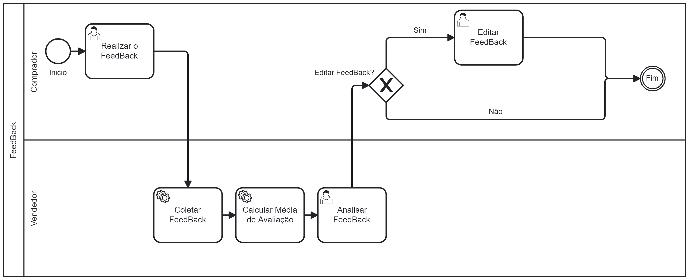

## 3.3.3 Processo 4 – Gestão de Feedback e Avaliações

Este processo é essencial para criar um ambiente de confiança e transparência na plataforma DriveNShop. Ele é dividido em três atividades principais, onde compradores podem avaliar vendedores após a venda, e os vendedores têm a oportunidade de responder a essas avaliações.

# Detalhamento das Atividades

## 1. Realizar o Feedback
**Descrição:** O comprador avalia a experiência de compra preenchendo um formulário de feedback.  
**Objetivo:** Coletar a opinião do comprador de forma estruturada.

## 2. Coletar Feedback
**Descrição:** O sistema registra e armazena o feedback fornecido pelo comprador.  
**Objetivo:** Garantir que as informações do feedback sejam armazenadas com segurança e acessíveis para análise.

## 3. Calcular Média de Avaliação
**Descrição:** O sistema calcula a média das avaliações recebidas pelo vendedor, com base nos feedbacks armazenados.  
**Objetivo:** Atualizar a pontuação média de reputação do vendedor no sistema e no front-end.

## 4. Analisar Feedback
**Descrição:** O vendedor pode visualizar e analisar os feedbacks recebidos, tanto individualmente quanto pela média de avaliação.  
**Objetivo:** Identificar pontos de melhoria e compreender a satisfação do cliente.

## 5. Editar Feedback
**Descrição:** O comprador tem a opção de editar um feedback enviado previamente, caso seja necessário corrigir ou atualizar informações.  
**Objetivo:** Permitir ajustes no feedback de forma controlada.

## 6. Fim do Processo
**Descrição:** O processo é finalizado após a análise do feedback pelo vendedor ou após a edição de um feedback pelo comprador.  
**Objetivo:** Encerrar o ciclo de feedback de maneira clara e organizada.

---
# Tabela de Detalhamento - Realizar Feedback

| **Campo**        | **Tipo**           | **Restrição**           | **Valor Default**  |
|-------------------|--------------------|-------------------------|--------------------|
| Avaliação         | Estrelas (1-5)    | Obrigatório             | 5 estrelas         |
| Comentário        | Caixa de texto    | Sem minimo de caracteres    | "----------------" |
| Tipo de Transação | Lista de seleção  | Obrigatório             | "VENDA"            |

### Comandos

| **Comando**   | **Destino**                        | **Tipo**  |
|---------------|------------------------------------|-----------|
| Enviar        | Enviar feedback preenchido         | Ação      |
| Editar        | Permitir ao usuário editar feedback| Ação      |
| Fechar (X)       | Permitir ao usuário voltar a página anterior| Ação      |

---

# Tabela de Detalhamento - Editar Feedback

| **Campo**        | **Tipo**           | **Restrição**           | **Valor Default**  |
|-------------------|--------------------|-------------------------|--------------------|
| Avaliação         | Estrelas (1-5)    | Obrigatório             | 5 estrelas         |
| Comentário        | Caixa de texto    | Sem minimo de caracteres    | "----------------" |
| Tipo de Transação | Lista de seleção  | Obrigatório             | "VENDA"            |

### Comandos

| **Comando**   | **Destino**                        | **Tipo**  |
|---------------|------------------------------------|-----------|
| Editar Avaliação       | Editar sua avaliação         | Ação      |
| Enviar        | Enviar feedback preenchido         | Ação      |
| Fechar (X)       | Permitir ao usuário voltar a página anterior| Ação      |

---

# Tabela de Detalhamento - Analisar Feedback

| **Campo**            | **Tipo**           | **Restrição**           | **Valor Default**  |
|-----------------------|--------------------|-------------------------|--------------------|
| Nome Usuário             | caixa de texto    | "--------------"             | Nenhum             |
| Avaliação             | Estrelas (1-5)    | "--------------"             | Nenhum             |
| Comentário            | Caixa de texto    | "--------------"    | "----------------" |
| Título da Negociação  | Caixa de texto    | "--------------"    | "----------------" |

### Comandos

| **Comando**   | **Destino**                           | **Tipo**       |
|---------------|---------------------------------------|----------------|
| Navegação     | Avançar ou voltar entre feedbacks     | Navegação      |

